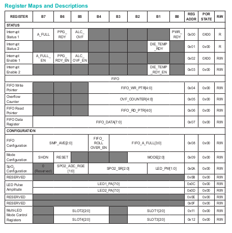
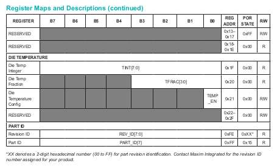

# Tutorial

This is an example of how a library for the MAX30102 Heart Rate and Pulse Oximetry sensor. We will do a partial walk through on how to implement the features and functionality as suggested in the [MAX30102 Datasheet](https://datasheets.maximintegrated.com/en/ds/MAX30102.pdf).
### Registers
The MAX30102 is controlled/adjusted using its eight bit registers. A register map detailed in the datasheet. Here is a snippet. 

We can see the register types, what each bit in the register does, the register address, its state when the device is powered on or reset (POR), and whether it is read only or writable. For example, 
###### Mode Configuration Register
* Writable
* All bits set to 0 on Power On or Reset
* Address at 0x09
* Bits
  * Most significant bit (MSB) B7 when set to 1, shuts down the sensor,
  * B6, when set to 1, resets the sensor,
  * B5, B4, B3 unused, default to 0,
  * Least Significant Bits (LSB) B2 and B1 for choosing the operating mode.
  
The register map is implemented in ESP32 by defining the register addresses.
''' c
/**
 * MAX30102 internal registers definitions.
 */
#define MAX30102_DEVICE                   0x57
// Part ID
#define MAX30102_REV_ID                   0xFE
#define MAX30102_PART_ID                  0xFF
// Status
// - Interrupts
#define MAX30102_INT_STATUS               0x00
#define MAX30102_INT_STATUS_2             0x01  
#define MAX30102_INT_ENABLE               0x02
#define MAX30102_INT_ENABLE_2             0x03
// - FIFO  
#define MAX30102_FIFO_WRITE               0x04
#define MAX30102_FIFO_OVERFLOW_COUNTER    0x05
#define MAX30102_FIFO_READ                0x06
#define MAX30102_FIFO_DATA                0x07
// Configuration
#define MAX30102_FIFO_CONF                0x08  
#define MAX30102_MODE_CONF                0x09
#define MAX30102_SPO2_CONF                0x0A
#define MAX30102_LED_CONF                 0x0C  
#define MAX30102_LED_CONF_2               0x0D
#define MAX30102_MULTILED_REG             0x11
#define MAX30102_MULTILED_REG_2           0x12
// Die Temperature    
#define MAX30102_TEMP_INT                 0x1F
#define MAX30102_TEMP_FRACTION            0x20
#define MAX30102_TEMP_CONFIG              0x21  
'''
We now define functions that read status of each register, and set the registers that are writable.
### Setting a Register
We will use the Mode Configuration as an example. The LSB bits select the mode, as given in the datasheet.

### Reading a Register
We will use the FIFO register for reading. This register contains the sensor data measured from the photodiode.

### Digital Signal Processing
Once the data is read, some digital signal processing steps are necessary to interpret the data. The DC component of the signal will need to be removed. The resulting signal is processed to detect the presences of peaks and troughs that form the heart beat. 
#### DC Removal

#### Butterworth Filter

#### SpO2 

### Results
A typical output from the simple example is shown, indicating the Heart Rate and oxygen saturation (SpO2)

### References

1. [MAX30102 Datasheet](https://datasheets.maximintegrated.com/en/ds/MAX30102.pdf)